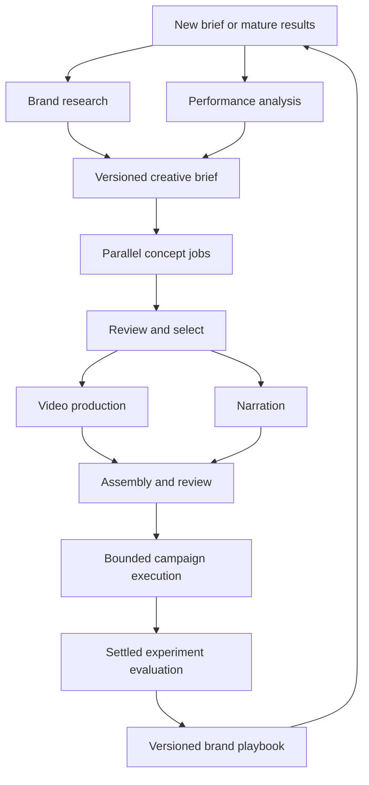

# Agent Studio integration plan

Status: proposed integration, with request-level cost accounting and agent attribution implemented in this change. The existing workflows still execute the work; a parallel multi-agent coordinator, arbitrary per-role model routing, experiments and net ROI reporting are not running yet.

## Product goal

Give each brand a coordinated creative team that researches, produces, measures and improves its advertising. The owner chooses the model for each role, sees predicted and incurred costs, and can compare business outcomes over time. The system optimizes for the brand's configured business goal within its spending and publishing boundaries. It does not promise a particular return.

Keep the current Node/SQLite/FFmpeg service and authenticated UI. Extend its durable job system, provider adapters, brand records, Meta ownership checks and usage ledger. A new orchestration framework is not required for the first release.

## Team and responsibilities

| Role | Inputs | Output | Execution and authority |
| --- | --- | --- | --- |
| Brand researcher | Public destination pages, approved claims, product references | Source-backed, dated brand knowledge | Runs on changed pages; cannot turn a scraped claim into an approved claim |
| Performance analyst | Settled ad metrics, conversions, learning state, prior experiments | Evidence-backed diagnosis and candidate hypotheses | Runs alongside research; read-only access to reporting |
| Creative strategist | Research, analysis and the campaign goal | Structured creative brief, audience/angle hypotheses, experiment design | Waits for required research/analysis versions |
| Copywriter | Approved brief and source excerpts | Hooks, scripts, headlines, calls to action | Independent concepts can be written in parallel |
| Creative director | Scripts, brand rules, visual references | Ranked storyboards and production instructions | Chooses which concepts justify the predicted production expense |
| Video producer | Approved storyboard and production allowance | H3 tasks and generated source clips | H3 768P defaults to $0.08/output second; all attempts are metered |
| Voice producer | Approved script and language | Narration | Runs alongside video when the script is frozen; media provider must support audio |
| Creative reviewer | Script, source references and rendered contact sheet | Structured findings and pass/review/block decision | Uses an independently configurable vision-capable model; deterministic media checks still apply |
| Community manager | Relevant ad, destination knowledge and comment history | Useful reply and the ad's message/form invitation | Independent queue; its cost and response limits remain separate |
| Response reviewer | Proposed public answer and its evidence | Grounding and suitability result | Cannot authorize itself or override a deterministic block |
| Media planner | Goal, eligible assets, readiness and approved creatives | Campaign structure and bounded change proposals | Only the existing execution service can publish or alter Meta objects |
| Budget analyst | Mature performance, uncertainty, learning state and cost ledger | Proposed allocation with expected value and downside | Runs analysis in parallel; budget writes serialize per brand/account |
| Experiment evaluator | Pre-registered trial, settled outcomes and full costs | Win/lose/inconclusive result with uncertainty | Promotes evidence into memory only after an evaluation gate |
| Learning curator | Evaluated experiments and reviewed feedback | Versioned, reusable playbook entries | Cannot rewrite software, approval rules, spend caps or credential policy |

A role is a durable job definition, not a permanently chatting process. Trigger work on meaningful events or a measured cadence. Deduplicate unchanged page research, avoid repeated full-history prompts, and stop a workflow when extra analysis has low expected value.

## Coordination and parallel work



Community work is a separate dependency graph sharing the brand knowledge snapshot. It must not delay emergency pauses, token revocation or delivery recovery.

Implementation:

1. Add `agent_runs`, `agent_tasks`, dependency edges and immutable artifact versions to SQLite. Extend the existing worker with a bounded set of concurrent jobs and separate heartbeats. SQLite leases guard duplicate claims across processes sharing the same local database.
2. A task is runnable only after every required dependency succeeded against the same brief/context version. Persist queued/running/succeeded/failed/cancelled/uncertain states, its lease, deadline and attempts. Failed dependencies block downstream work; optional inputs must be explicitly marked optional.
3. Reserve the entire request's maximum affordable exposure atomically before calling a provider. Apply workspace, brand, role, workflow and provider concurrency limits. Every continuation, tool call and fallback has a step limit and a new cost reservation.
4. Serialize campaign activation, budget allocation and other mutations per brand/account. Use the existing effect ledger and ownership checks; the LLM cannot call Meta directly or widen its own permissions.
5. Keep pause/stop work highest priority. Recheck pause state, scope, authorizations and budgets immediately before each external write. Cancelling an agent run prevents new work but retains already incurred costs and pending video tasks.
6. For a timeout after a paid submission, preserve exposure and reconcile provider request/task IDs. Never automatically repeat a video generation with an unknown outcome. A deliberately configured LLM fallback is a separate paid attempt, subject to the remaining allowance and a clear audit record.
7. Start conservatively with a small concurrency pool, measure rate-limit and latency data, then tune operational limits. Concurrency does not increase a spending ceiling.

## A provider-agnostic brain

Separate the role, model configuration, transport adapter and tools. Prompt text must not contain a provider name or endpoint dependency.

Proposed contracts:

```ts
interface AgentModelConfig {
  id: string;
  version: number;
  providerConnectionId: string; // encrypted server-side secret reference
  adapter: 'openai-responses' | 'openai-compatible-chat' | 'anthropic' | 'gemini' | 'local';
  modelId: string;              // owner-selected ID, validated by capability checks
  parameters: Record<string, unknown>;
  capabilities: Array<'text' | 'vision' | 'structured-output' | 'tools'>;
  maxInputTokens: number;
  maxOutputTokens: number;
  timeoutMs: number;
  rateCardVersion: string;
  fallbackConfigIds: string[];  // explicit choices, no silent provider substitution
}
interface AgentDefinition {
  role: string;
  promptVersion: string;
  outputSchemaVersion: string;
  modelConfigId: string;
  allowedTools: string[];
  maxSteps: number;
  maxRequests: number;
  maxCostMicros: number;
}
```

- Start by extracting the current OpenAI Responses and MiniMax/Z.AI chat transports behind a normalized interface. MiniMax and GLM are first-class choices. Add other compatible providers and self-hosted models through adapters rather than changes to agent business logic. No model is preferred merely because of its country of origin.
- The owner selects a default model, per-role overrides and optional per-brand overrides. Freeze resolved configuration versions when a run starts, so editing a selector cannot change half an in-flight experiment.
- A model's actual capabilities matter: a text-only model can strategize but cannot inspect a contact sheet. Validate output schema, context limits, tool support, regional endpoint and credential scope before enabling a role. Reject unsupported capabilities visibly.
- Validate all model output with deterministic schemas. Require source IDs, claims and concise decision rationales; do not store private chain-of-thought. A schema-repair call is optional, bounded, recorded and paid.
- Media generation remains a tool separate from the reasoning model. A GLM strategist can direct an H3 video producer, for example. The owner's selected video and voice providers are independent choices.
- Normalize usage without flattening different billing units: tokens, cache writes/reads, reasoning subsets, video seconds, input images, audio seconds and characters. Adapter-specific receipts remain available. Missing metrics are unknown, never fabricated.
- Self-hosted models still have compute costs. Track allocated CPU/GPU time and infrastructure costs separately from token counts; absence of a vendor token invoice does not make them free.
- Connections and endpoints are owner-controlled. Validate public HTTPS destinations and DNS/redirect behavior, scope a credential to its configured host, and prevent page or model text from choosing an endpoint or secret. Local models need an explicitly configured server-side connection, not browser-provided arbitrary URLs.
- "Agnostic" means interchangeable through a verified adapter and capability contract, not assuming every vendor implements the same JSON fields.

## Shared memory and improvement over time

Use four distinct forms of brand-scoped memory:

| Memory | Contents | Update rule |
| --- | --- | --- |
| Approved brand facts | Product/offer truth, claim limits, brand voice, exclusions | Owner-controlled; other agents can propose changes |
| Source knowledge | Page text, dated quotations, source hashes and freshness | Refresh when changed; supersede old versions without losing provenance |
| Experiment evidence | Hypothesis, treatment/control IDs, assignments, mature results, complete costs | Append from evaluated experiments; preserve inconclusive and negative results |
| Playbook | Supported patterns by product, market, placement, stage and creative type | Versioned promotion/rollback after evaluation; expiry for stale findings |

Every artifact records the source and memory versions it used. Fetch only relevant material into a task's context. Exclude one brand's private data from another brand's prompts. Cache immutable source summaries by brand and source hash; redact unnecessary personal information from comments and CRM data.

This learning loop changes retrieved knowledge, prompts and approved playbook choices. It does not automatically retrain model weights or permit agents to rewrite their execution code. Prompt/model changes are versioned treatments, evaluated against a baseline and reversible.

Promotion requires enough eligible outcomes, appropriate attribution maturity and a recorded comparison. One successful ad is a hypothesis, not a universal rule. Track negative results, contradictory evidence, audience saturation and changes to product, season or landing page. Expire or downgrade old guidance when those contexts change.

## Predicted cost, actual usage and economic return

The implemented ledger already records action/agent role, provider/model, brand/run/creative IDs, request/task IDs, attempts, original estimate, saved rate, token breakdown and cost state. It records production and engagement calls, including invalid outputs and unresolved submissions. It also carries optional experiment and configuration-version fields for the next integration.

Add a workflow quote before starting the agent team:

- Sum expected input/output tokens for each planned role, selected model and step. Use measured recent distributions when enough matching history exists; otherwise show a conservative bound from prompt bytes and configured output limits.
- Show typical forecast, upper reservation and the maximum number of paid attempts separately. Do not assume a cache discount before it occurs. Include review, repair, narration, generation failures and model fallback allowances.
- H3 768P: one 8-second shot is $0.64; two shots are $1.28. For `N` selected creatives, initial video cost is `N × $1.28`, plus any billed reference inputs. A second or third generated revision incurs new cost. Locally derived aspect-ratio variants incur no extra H3 request.
- H3's first five input images are free; subsequent images cost $0.04 each. Input video is charged per second at the output-resolution rate; input audio is free under the verified current H3 price schedule. The current app supplies at most one product reference image and no input video/audio.
- Stop before dispatch if the maximum new exposure cannot fit the applicable allowance. Do not use expected future revenue to bypass a cash-spend limit.

Price snapshots are immutable per attempt. Cost views must distinguish calculated-from-usage, estimated, reserved, unresolved and unpriced amounts. A later provider invoice reconciliation should be an append-only adjustment, with invoice ID, currency, original amount and reason; it must not erase the original receipt.

### Attribution

Use `brand → experiment → campaign run → creative → ad` links. Also retain the task DAG and artifact versions so shared costs are allocated once:

- Charge a generated creative once even when reused in several placements or ads.
- Keep failed/rejected creative production in the experiment's total cost.
- Allocate shared research and planning explicitly, using a saved policy such as equal assignment to treatments or proportional attributed impressions. Show unallocated brand overhead separately.
- Keep community costs in a separate goal/cohort until message/form/CRM events establish a reliable connection. A public reply is not itself a conversion.
- Deduplicate Meta ad/day reporting snapshots, preserve attribution windows and wait for mature results. Separate simulation and staging from live returns.
- Retain advertising currency and AI billing currency. Convert with a dated FX-rate snapshot before combining them; when FX or revenue is absent, show that ROI is unavailable rather than adding unlike currencies.

### Metrics shown to the owner

| Metric | Definition | Required evidence |
| --- | --- | --- |
| AI cost | Sum of included role/media request costs plus allocated overhead | Usage receipts; estimates and unresolved exposure remain separate |
| Effective CPA | (Ad spend + allocated AI/production cost) / qualified conversions | Deduplicated, mature conversions and common currency |
| ROAS | Attributed revenue / ad spend | Purchase values and attribution; this is revenue efficiency, not profit |
| Revenue efficiency including AI | Attributed revenue / (ad spend + allocated AI cost) | The same evidence plus cost allocation |
| Net marketing ROI | (Contribution before marketing − marketing cost) / marketing cost | Net sales less refunds/taxes, COGS and variable fulfilment costs; marketing cost includes ads, AI and incremental operating costs |
| Agent/model incremental return | Incremental contribution versus control, less incremental AI/marketing cost | A comparable, sufficiently powered experiment; observational association is labelled separately |

Do not double-subtract COGS if a supplied contribution margin already includes it. Do not show infinite ROI for a zero denominator. Lead brands need CRM-qualified lead value and observed close/margin data; clicks, comments and raw form submissions cannot stand in for realized profit.

Show low/base/high forecast scenarios with assumptions and uncertainty, plus realized results after attribution settles. Expected ROI is a forecast, not a guarantee. A creative gets one business outcome; avoid crediting the same revenue in full to every participating agent.

## Experimental optimization

1. Specify goal, audience eligibility, outcome window, baseline, minimum sample, stopping rule, budget and maximum downside before launch.
2. Compare creative/model/prompt treatments with a stable assignment unit. Change one major factor at a time where possible. Do not confuse Meta's adaptive delivery allocation with a randomized causal experiment.
3. Use settled outcomes and account learning state. Diagnose tracking problems, learning limitations and small samples before proposing budget changes.
4. Apply shrinkage/uncertainty-aware rankings; include failed creatives and costs, not only delivered winners. Use holdouts or credible platform experiments when available. Mark purely observational results as such.
5. Initially run the analyst, strategist and budget roles in shadow mode: produce forecasts/proposals and compare them with the current deterministic decisions without changing delivery.
6. Promote a role/model configuration after offline evaluations and limited live experiments meet the acceptance criteria. Expand bounded autonomy per brand; retain rollback to the previous version.
7. Measure useful value per dollar as well as quality: grounded outputs, review pass rate, completion latency, costs, mature CPA, contribution and downside. Choose models on evidence for the role, not a universal leaderboard.

## Owner-facing screens

- **Agent Studio:** role cards with selected model, capabilities, mode (off/shadow/review/bounded auto), current work, last result, cost today and allowances. Configure defaults and brand overrides here.
- **Run planner:** planned parallel tasks, dependencies, model choices, estimated requests/tokens/media seconds, typical and upper cost, and expected outcome scenarios.
- **Run detail:** timeline/DAG, inputs and evidence, versioned artifacts, review decisions, retries, provider receipts and execution status. Show an ordinary business summary first.
- **Brand memory:** approved facts, page knowledge, playbook versions, dated evidence and rollback controls.
- **Experiments & ROI:** treatment comparisons, maturity, uncertainty, ad + AI cost, revenue/contribution and forecast-versus-realized outcomes.
- **Usage & costs:** implemented now; keep the request drilldown and CSV export, adding role/experiment/model-configuration selectors as orchestration ships.

## Delivery sequence and acceptance gates

| Step | Concrete changes | Acceptance gate |
| --- | --- | --- |
| 0 — metering foundation, this change | H3 768P adapter; durable ledger; role attribution; immutable rate snapshots; cost UI/export | No double billing during recovery; correct H3/cache arithmetic; simulations cost zero; missing telemetry stays visible |
| 1 — configurable brain | Provider connections, capability catalogue, common adapter response, versioned per-role model config, shadow research/analysis roles | Owner can switch a role between MiniMax and GLM without changing task logic; unknown models/capabilities are rejected; every call quotes and records its cost |
| 2 — coordinator and creative team | Dependency-aware concurrent jobs, shared brief versions, creative direction/copy/video/voice/review roles | Concurrent tasks share a budget safely; restart resumes; cancellation prevents new writes; no direct LLM access to Meta credentials |
| 3 — evidence and ROI | Immutable experiment assignments, cost allocation, FX snapshots, CRM outcomes, margin inputs and evaluation views | No duplicate revenue/cost; ROI unavailable when essential data is missing; forecast and realized results are distinguishable |
| 4 — learning and bounded optimization | Evaluated playbook promotion, shadow-to-live role gates, budget proposals through existing controls | Improved outcomes are demonstrated against a baseline; rejected proposals and rollbacks are auditable; caps remain enforced outside the LLM |

Next code boundary: add `src/agents/{contracts,registry,router,coordinator,memory,evaluation}.ts` with contract tests and one shadow workflow. Migrate current workflows incrementally instead of replacing all recovery and publishing logic at once. Preserve the current deterministic optimizer as the baseline and fallback throughout the rollout.

## References used for the implemented video and metering contract

- [MiniMax H3 creation contract](https://platform.minimax.io/docs/api-reference/video-generation-v2-create)
- [MiniMax H3 task receipt](https://platform.minimax.io/docs/api-reference/video-generation-v2-query)
- [MiniMax pay-as-you-go rates](https://platform.minimax.io/docs/guides/pricing-paygo)
- [MiniMax prompt caching](https://platform.minimax.io/docs/api-reference/text-prompt-caching)
- [Z.AI model pricing](https://docs.z.ai/guides/overview/pricing)

The agent orchestration, memory and evaluation design above is a proposed architecture for this repository. The provider links establish API/pricing details, not evidence that the proposed agent system will improve ROI.
